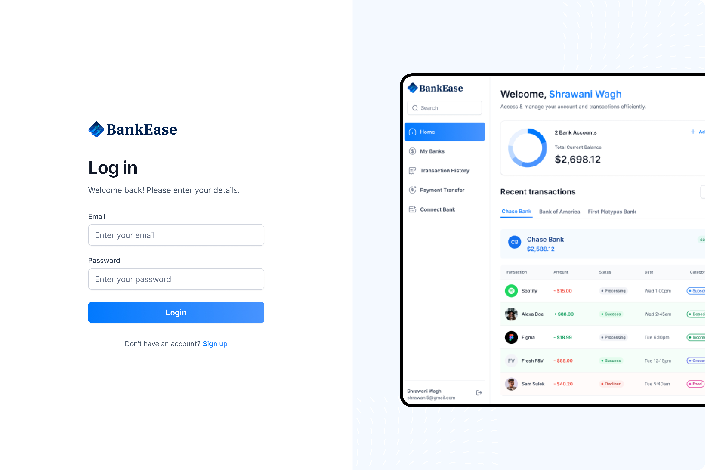
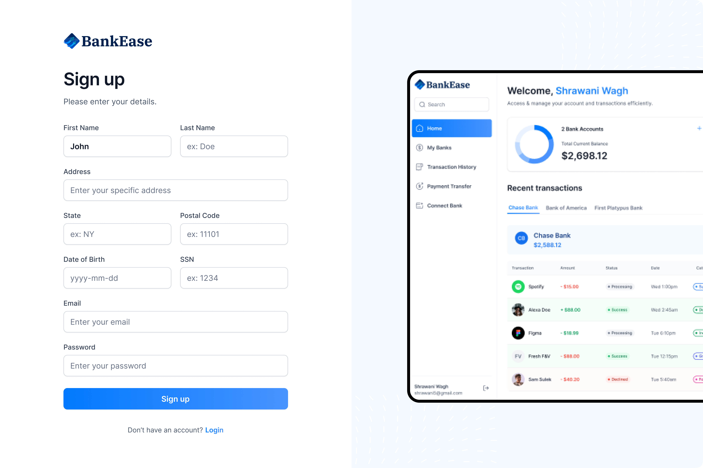
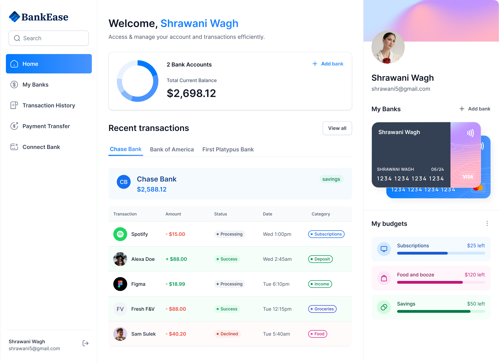

# **BankEase**  

Welcome to **BankEase**, a comprehensive solution for seamless bank management.

---

## **🎨 UI Overview**

The user interface is designed for simplicity and functionality, featuring a responsive layout and real-time data updates.

### **Login Page**  
  
*The login page allows users to securely sign into their accounts using email and password, providing a secure gateway to their financial information.*

### **Signup Page**  
  
*The signup page enables new users to create an account by providing their basic information such as name, email, and password. It ensures a smooth onboarding process.*

### **Dashboard View**  
  
*The dashboard offers a comprehensive overview of the user's financial status, displaying total balance, recent transactions, and analytics for quick insights.*

### **My Banks**  
  
*The "My Banks" section allows users to manage their linked bank accounts, view account details, and perform basic banking operations.*

### **Transaction History**  
  
*Users can access their complete transaction history, enabling them to track spending, transfers, and deposits over time.*

### **Payment Transfer**  
  
*This section facilitates seamless payment transfers, allowing users to send funds to any recipient, either by selecting from saved contacts or entering new ones.*

*(Above: Screenshot of the dashboard showcasing total balance, recent transactions, and analytics.)*

---

## **🔋 Features**

- **Authentication**: An ultra-secure SSR authentication with proper validations and authorization.
- **Connect Banks**: Integrates with Plaid for linking multiple bank accounts seamlessly.
- **Home Page**: Displays a general overview of the user account with total balance from all connected banks, recent transactions, spending across different categories, and more.
- **My Banks**: View the complete list of all connected banks with respective balances and account details.
- **Transaction History**: Includes pagination and filtering options for viewing transaction history of different banks.
- **Real-time Updates**: Changes are reflected across relevant pages when new bank accounts are connected.
- **Funds Transfer**: Allows users to transfer funds using Dwolla to other accounts by entering required fields and recipient bank ID.
- **Responsiveness**: Ensures seamless adaptability across desktop, tablet, and mobile devices, providing a consistent user experience.

And many more, including robust code architecture and reusability.

---

## **📽️ Application Demo**

Watch the application in action below:  

<video controls width="600">
  <source src="./public/UI/BankEase_video.mp4" type="video/mp4">
  Your browser does not support the video tag. Please download the video [here](./assets/demo-video.mp4).
</video>  

*(Above: A quick walkthrough of the application's features.)*

---

## **Quick Start**

Follow the instructions to set up the project locally.
```bash
# Clone the repository
git clone https://github.com/shrawaniwagh2003/BankEase.git
cd BankEase

# Install dependencies
npm install

# Start the development server
npm run dev
